<p align="center">
  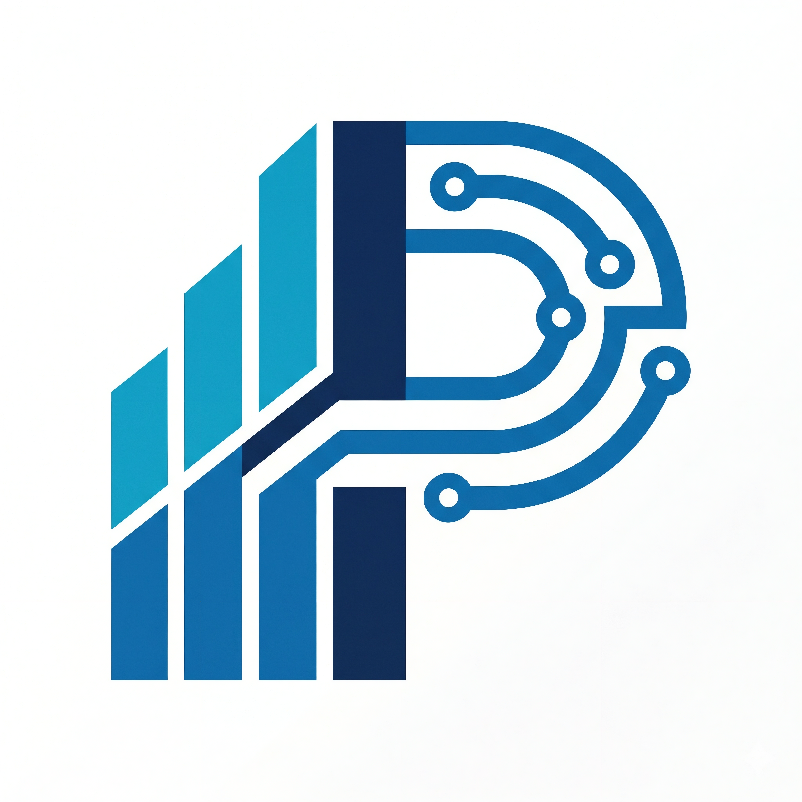
</p>

<h1 align="center">AUST Intelligent Parking Management System (AUST-IPMS)</h1>

<p align="center">
  <strong>An automated, real-time, AI-ready parking management system for the Ahsanullah University of Science and Technology (AUST) campus.</strong>
</p>

<p align="center">
  
  
  
  
  <br />
  
  
  
  
</p>

---

## 📖 Overview

The **AUST Intelligent Parking Management System (AUST-IPMS)** is a comprehensive solution designed to optimize, monitor, and manage the parking spaces across **Basement 1** and **Basement 2** of the AUST campus. 

With rising vehicle counts among faculty, students, and guests, the manual allocation of parking spaces has become inefficient. AUST-IPMS solves this by providing:
- Real-time slot-by-slot tracking for Basements 1 and 2.
- Interactive, responsive visual maps for quick parking availability verification.
- Tailored analytics highlighting occupancy rates, peak hours, and trends.
- Future computer vision (OpenCV + YOLO) and License Plate Recognition (ANPR) integrations.
- An upcoming machine learning module to forecast parking demand based on the AUST academic calendar.

> [!NOTE]
> The project is currently in **Phase 1 (Frontend Only)**. All dashboard and status interfaces are fully responsive and feature realistic mock datasets. A backend plan is established for future phases.

---

## ⚡ Key Features

*   **Basement Parking Layout Map**: Dynamic, interactive visualizer showing slot occupancy status (Available, Occupied, Reserved).
*   **Zone-Specific Allocation**:
    *   **Basement 1 (Student Zone)**: 140 dedicated slots.
    *   **Basement 2 (Faculty/Staff Zone)**: 50 dedicated slots.
    *   **Basement 2 (Guest & Visitor Zone)**: 30 dedicated slots.
*   **Occupancy Analytics**: Deep analytics including hourly occupancy logs, daily trends, and peak demand notifications.
*   **Academic Calendar Sync**: (Planned) Forecasts parking needs by cross-referencing AUST exam weeks, holidays, and campus events.
*   **Computer Vision Integration**: (Planned) Live feeds from basement cameras that detect vehicle presence without requiring expensive ground sensors.

---

## 🛠️ Technology Stack

### Frontend
- **Framework**: React 19 (Vite)
- **Styling**: Tailwind CSS v4.3.0 & Custom CSS Variables (Glassmorphism & Neon Orbs UI)
- **Icons**: Lucide React
- **Animations**: Framer Motion
- **Charts**: Recharts
- **State/Routing**: React Router DOM (v7)

### Backend (Planned)
- **Framework**: Python FastAPI
- **Database**: PostgreSQL (relational logs) & Redis (live availability cache)
- **Real-Time Communications**: WebSockets (live camera feeds and sensor states)
- **Computer Vision**: OpenCV + YOLOv8 (for vehicle counting and empty slot identification)
- **ANPR**: License Plate Recognition for gate control

---

## 🔄 System Workflow

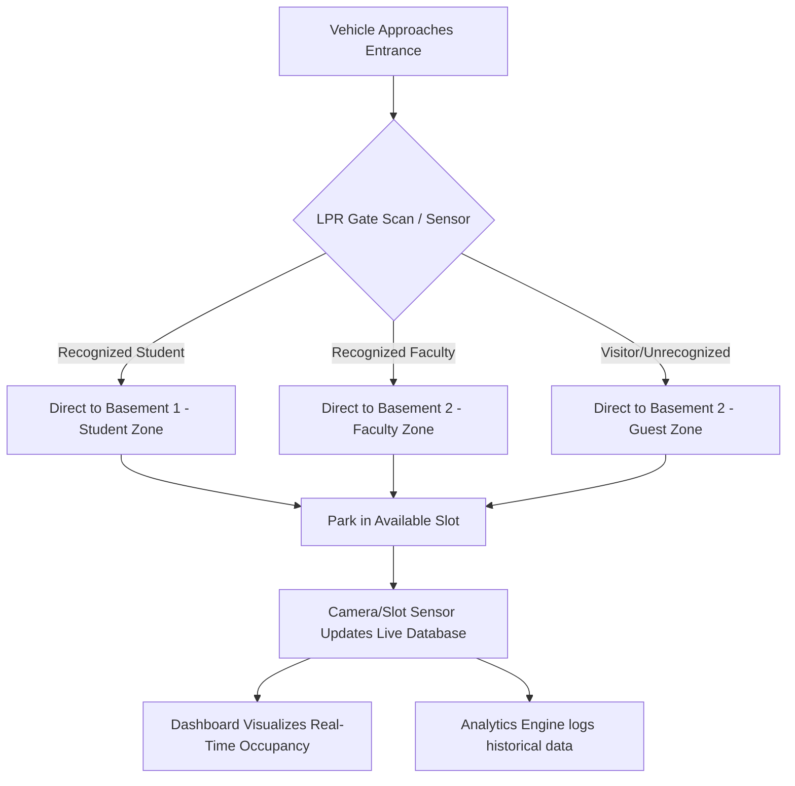

---

## 🖥️ Page Walkthrough & Screenshots

Here is a look at the current interface implementation in **Light Mode**:

### 1. Home Page
The dashboard landing page. It showcases real-time summary cards, current basement utilization bars, key features, platform capabilities, and the complete operational workflow.
<p align="center">
  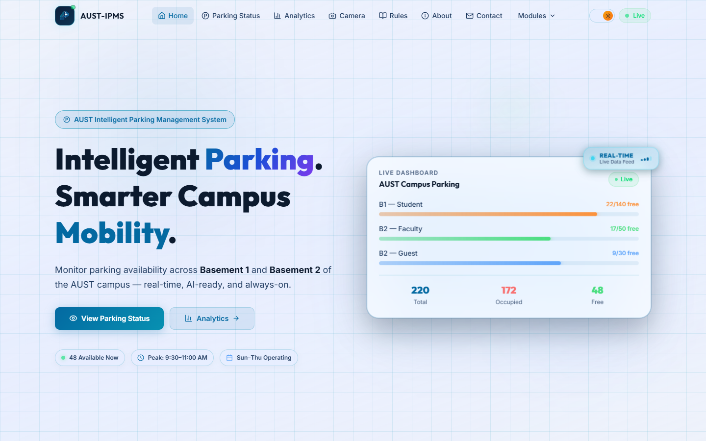
</p>

### 2. Live Parking Status
An interactive layout map representing Basement 1 and Basement 2. Users can filter by basement and hover over slots to check details. Slots change color dynamically (Green = Available, Red = Occupied, Purple = Reserved).
<p align="center">
  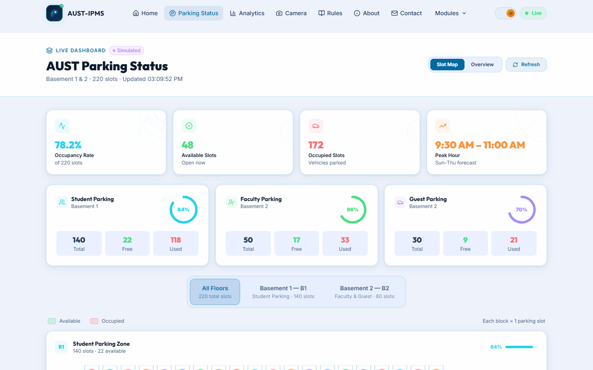
</p>

### 3. Occupancy Analytics
Integrates Recharts to provide detailed visual representations of parking trends. It includes a Peak Hour Alert banner, Hourly Occupancy charts, Daily Occupancy logs, and Week-over-Week comparisons.
<p align="center">
  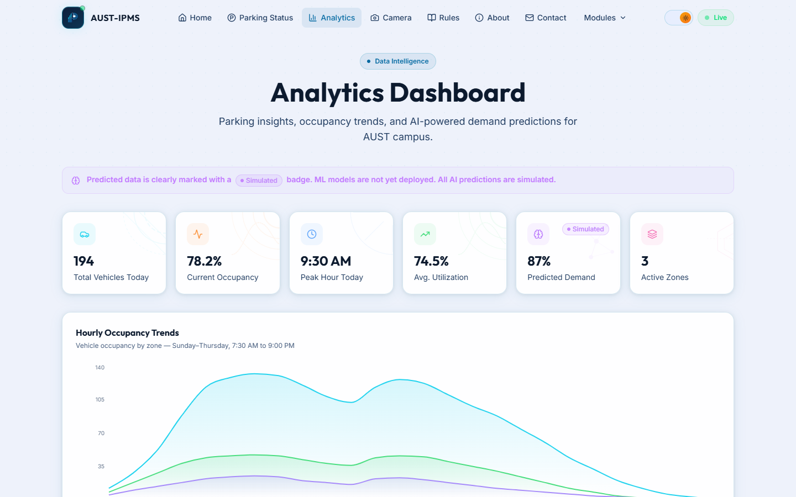
</p>

### 4. Camera Monitoring
A placeholder grid for computer vision cameras. It models camera feeds, license plate scanning output, and detects whether individual slots monitored by cameras are free or occupied.
<p align="center">
  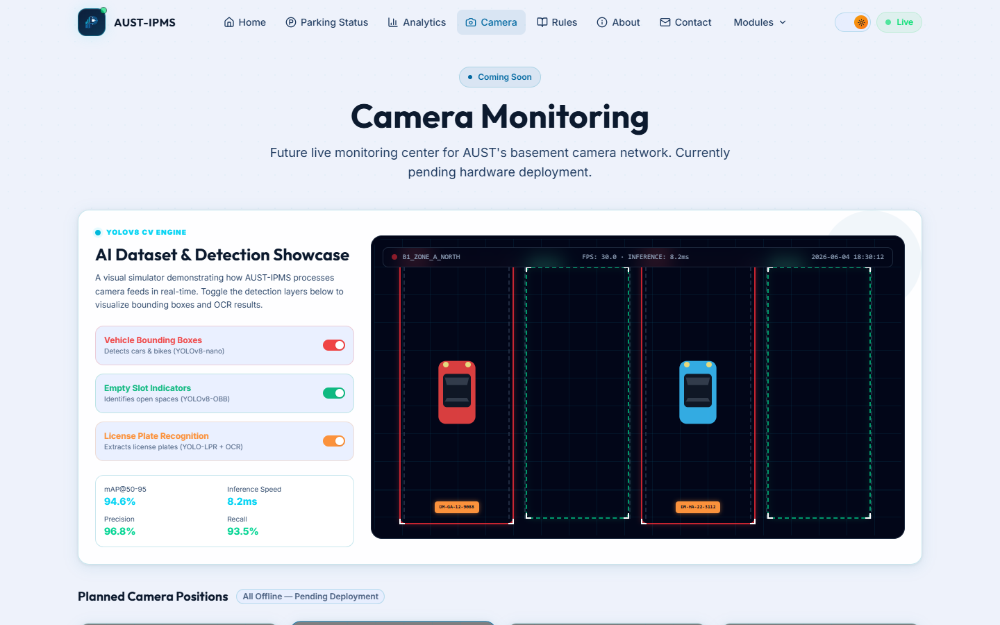
</p>

### 5. Rules & Regulations
Outlines the official parking policies of the university, including operational timings (Sunday–Thursday, 7:30 AM – 9:00 PM), speed limits (15 km/h), vehicle classification criteria, and rules for entry/exit gates.
<p align="center">
  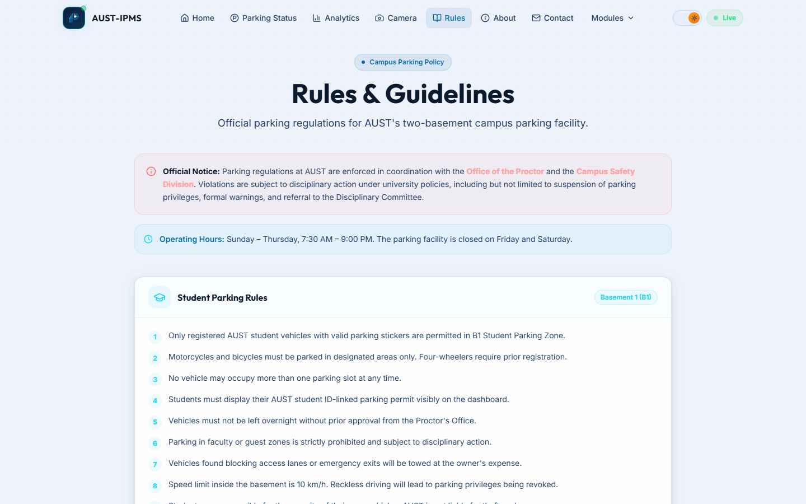
</p>

### 6. About AUST-IPMS
Contains the detailed project background, development objectives, aligned governance authorities, and a comprehensive breakdown of the project development phases.
<p align="center">
  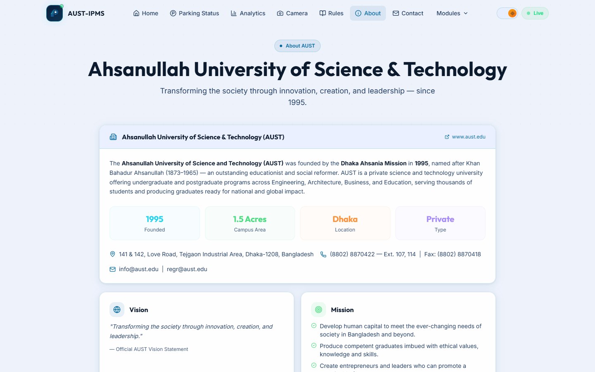
</p>

### 7. Notifications & Alerts
A dedicated alert center informing users of peak traffic status, slot limits reached, scheduled maintenance, or unrecognized vehicle logs.
<p align="center">
  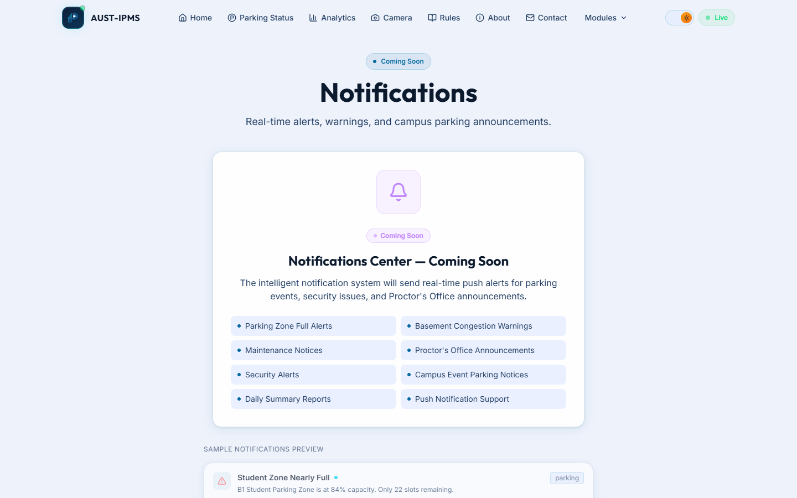
</p>

### 8. Admin Control Panel
A specialized view to change parking settings, configure zone sizes, manually trigger gate overrides, and review security logs.
<p align="center">
  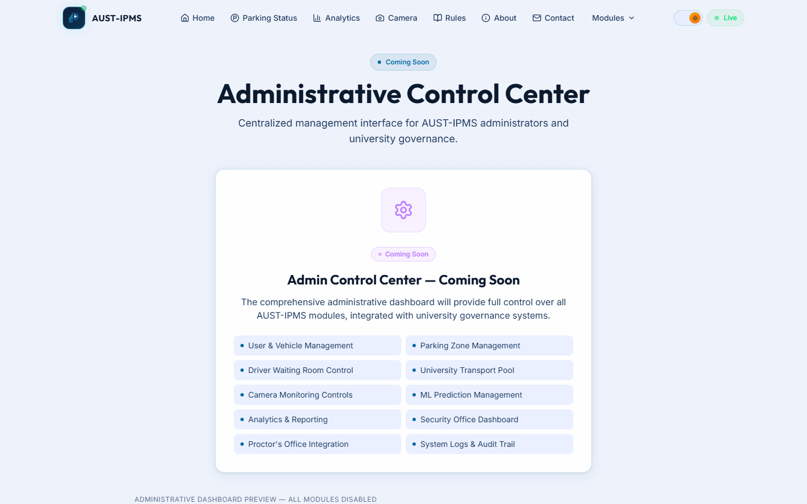
</p>

### 9. User Profile
Provides logged-in users (Students, Faculty, or Admins) with details of their registered vehicles, active parking sessions, and roles.
<p align="center">
  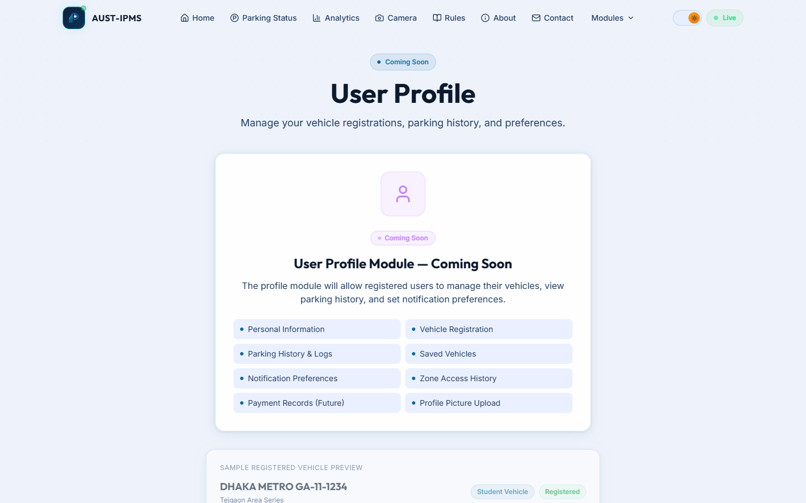
</p>

### 10. Login Portal
Secure authentication gateway with support for student, faculty, and administrator credentials.
<p align="center">
  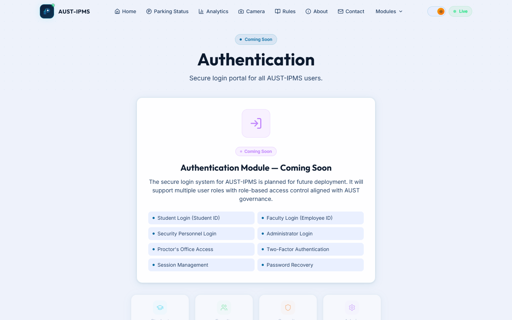
</p>

### 11. Contact & Feedback
A response form allowing AUST members to submit issues, report parking blockages, or ask queries directly to the engineering team.
<p align="center">
  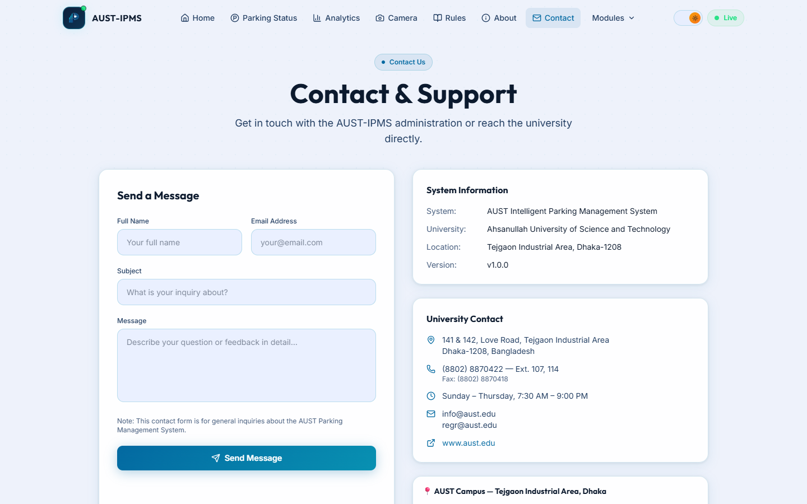
</p>

---

## 🔮 Future Updates & Roadmap

| Phase | Scope | Description | Target |
| :--- | :--- | :--- | :--- |
| **Phase 1** | **Frontend Client** | Interactive client dashboard with mocks and UI layout maps | **2026 Q2** *(Completed)* |
| **Phase 2** | **Backend API & WS** | FastAPI setup, JWT authentication, and WebSockets live streams | **2026 Q3** |
| **Phase 3** | **Vision & LPR** | CCTV camera feeds integration and YOLOv8 plate scanner implementation | **2026 Q4** |
| **Phase 4** | **ML Predictions** | Historical parking demand analysis integrated with AUST calendar | **2027 Q1** |
| **Phase 5** | **System Integration**| Integration with AUST ICT Center database and security gates | **2027 Q2** |

---

## 🚀 Getting Started

To run the frontend client locally:

### Prerequisites
Make sure you have [Node.js](https://nodejs.org/) installed (v18.x or above is recommended).

### Installation
1. Clone this repository to your local machine:
   ```bash
   git clone https://github.com/oritri98/Smart_Parking_Lot
   cd AUST-IPMS/frontend
   ```
2. Install dependencies:
   ```bash
   npm install
   ```
3. Run the development server:
   ```bash
   npm run dev
   ```
4. Open your browser and navigate to `http://localhost:5173`.

---

## 🏛️ Governance Alignment

This project is developed to align with AUST campus infrastructure guidelines and in coordination with:
- **Office of the Proctor**, AUST
- **Office of the University Engineer**, AUST
- **ICT Center**, AUST
- **Campus Safety Division**, AUST

---

## 👥 Core Contributors

This project is developed and maintained by:

*   **👨‍💻 M.M. Faysal Iqbal** — **Lead Developer & Service Architect**
    *   Designed the backend architecture blueprint and structured data types.
    *   Implemented core business logic services (Authentication, Analytics, Camera, Parking, and Vehicles).
    *   Developed the Admin Control Panel, Camera Monitoring interface, and user authentication pages.

*   **👩‍💻 Ismat Erena Siddiquee** — **Frontend Architect & UI Developer**
    *   Established the project build configuration, routing architecture, and global Theme Context.
    *   Designed and styled key UI components, Main Layout, and navigation interfaces.
    *   Developed interactive pages including Live Parking Status, Analytics charts, and Rules view.

---

## 🤝 Contribution Guidelines

Contributions are welcome! If you would like to improve this project, please follow these guidelines:

1. **Fork** the repository.
2. **Create a new branch** (`git checkout -b feature/AmazingFeature`).
3. **Commit your changes** (`git commit -m 'Add some AmazingFeature'`).
4. **Push to the branch** (`git push origin feature/AmazingFeature`).
5. **Open a Pull Request**.

---


---

<p align="center">
  Developed with ❤️ for AUST Campus Mobility
</p>
