<p align="center">
  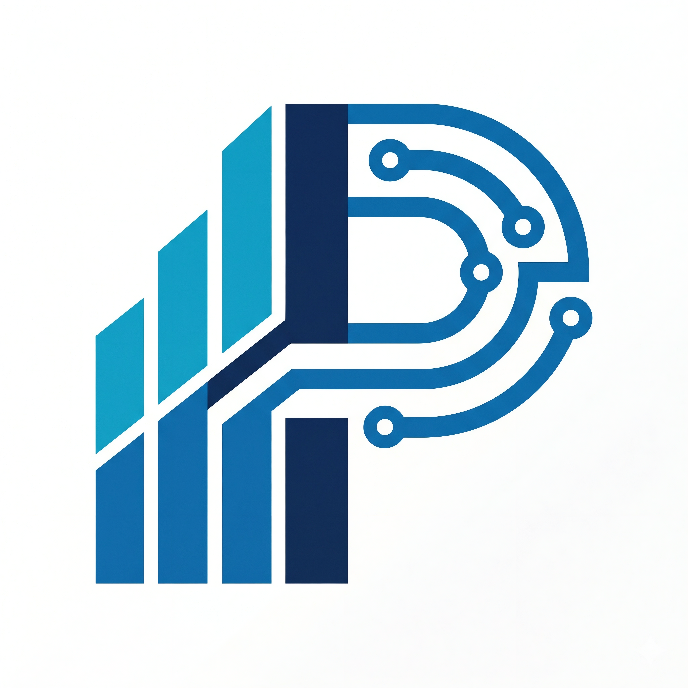
</p>

<h1 align="center">AUST Intelligent Parking Management System (AUST-IPMS)</h1>

<p align="center">
  <strong>A full-stack, real-time, AI-powered parking management system for the Ahsanullah University of Science and Technology (AUST) campus.</strong>
</p>

<p align="center">
  <!-- Frontend -->
  
  
  
  
  <br />
  <!-- Backend -->
  
  
  
  <br />
  <!-- Vision / ML -->
  
  
  
  <br />
  <!-- Deployment -->
  
  
</p>

---

## 📖 Overview

The **AUST Intelligent Parking Management System (AUST-IPMS)** is a production-ready, three-tier full-stack solution designed to automate, monitor, and manage parking across **Basement 1** and **Basement 2** of the AUST campus (141 & 142 Love Road, Tejgaon, Dhaka-1208).

With rising vehicle counts among faculty, students, and guests, the manual allocation of parking spaces has become inefficient. AUST-IPMS solves this by providing:
- Real-time slot-by-slot tracking across 220 parking spaces in B1 and B2.
- Interactive, responsive visual layout maps with live occupancy status.
- A full **REST API backend** (Laravel 12 / PHP 8.2) with HMAC-SHA256 signed session authentication and campus gate policy enforcement.
- A dedicated **Computer Vision & LPR microservice** (FastAPI + YOLOv8) for automated slot detection and Bangladeshi ANPR license plate recognition.
- Detailed analytics including hourly occupancy logs, daily trends, and peak demand alerts.
- A secured **Admin Control Panel** with 8 management modules including LPR simulator, vehicle registry, CCTV surveillance management, and full audit trail.

> [!NOTE]
> The project is currently in **Phase 2 (Full-Stack + Vision Microservice)**. The Laravel 12 REST API backend is fully operational, the YOLOv8 Vision & LPR microservice is deployed, and both are connected to the React 19 frontend. All services are containerized and Railway-deploy-ready.

---

## ⚡ Key Features

*   **Basement Parking Layout Map**: Dynamic, interactive slot grid showing real-time occupancy status (Available, Occupied, Reserved) fetched from the Laravel REST API.
*   **Zone-Specific Allocation** (220 Total Slots):
    *   **Basement 1 (Student Zone)**: 140 dedicated slots.
    *   **Basement 2 (Faculty/Staff Zone)**: 50 dedicated slots.
    *   **Basement 2 (Guest & Visitor Zone)**: 30 dedicated slots.
*   **AUST Campus Gate Policy Engine**: Automatically directs vehicles to the correct zone based on registration category (Student → B1, Faculty → B2, Guest → B2 Guest Zone).
*   **HMAC-SHA256 Session Authentication**: Secure admin login with BCrypt password verification, signed tokens, and constant-time comparison against timing attacks.
*   **YOLOv8 Slot Occupancy Detection**: FastAPI microservice processes camera frames to identify occupied vs. available parking slots with bounding box coordinates.
*   **Bangladeshi ANPR / LPR Recognition**: Reads and classifies Bangladeshi license plates (e.g., `DHAKA-METRO-GA-11-2233`) and routes vehicles accordingly.
*   **Admin Control Panel (8 Modules)**: Full operational command center with LPR simulator, vehicle blacklist, camera node toggles, campus broadcast system, user access control, ML model configuration, and downloadable audit logs.
*   **Occupancy Analytics**: Recharts visualizations for hourly usage, daily trends, and week-over-week comparisons with peak demand alerts (9:30 AM – 11:00 AM).
*   **Camera Monitoring Grid**: 8 CCTV node management interface with ping diagnostics and live analytics from the vision microservice.
*   **Emergency Lockdown**: Single-click campus-wide gate barrier lockdown with full audit logging.
*   **Data Exports**: Vehicle registry (CSV) and full system configuration backup (JSON) from the admin panel.

---

## 🛠️ Technology Stack

### 🖥️ Frontend (`frontend/`)
| Technology | Version | Role |
| :--- | :--- | :--- |
| React | 19.x | UI Framework |
| Vite | 8.0.16 | Build Tool |
| TypeScript | 6.0 | Type Safety |
| Tailwind CSS | 4.3.0 | Styling (Glassmorphism + Neon UI) |
| Framer Motion | 12.x | Animations & Micro-interactions |
| Recharts | 3.x | Analytics Charts |
| React Router DOM | 7.x | Client-side Routing |
| Lucide React | 1.x | Icon Library |
| Axios | 1.x | HTTP API Client |

### 🐘 Backend REST API (`backend/`)
| Technology | Version | Role |
| :--- | :--- | :--- |
| Laravel | 12.0 | REST API Framework |
| PHP | 8.2 | Runtime |
| SQLite | — | Persistent Database |
| Laravel Cache | — | In-memory State Store (zones, vehicles, notifications) |
| HMAC-SHA256 | — | Session Token Signing |
| BCrypt | — | Admin Password Hashing |

### 🤖 Vision & ML Microservice (`vision-service/`)
| Technology | Version | Role |
| :--- | :--- | :--- |
| FastAPI | 0.110+ | ML API Framework |
| Python | 3.10 | Runtime |
| Ultralytics YOLOv8 | 8.1+ | Parking Slot Object Detection |
| OpenCV | 4.9 | Image Pre-processing |
| Pillow | 10.x | Image I/O |
| Uvicorn | 0.28+ | ASGI Server |
| Pydantic | 2.x | Data Validation |

### 🚀 Infrastructure & Deployment
| Technology | Role |
| :--- | :--- |
| Docker + Docker Compose | Local full-stack orchestration |
| Railway | Cloud PaaS deployment for all 3 services |
| Nginx | Static file serving for production frontend build |

---

## 📁 Project Structure

```
AUST-IPMS/
├── frontend/                  # React 19 + Vite + TypeScript client
│   ├── src/
│   │   ├── pages/             # 13 application pages (Home, Admin, Camera, etc.)
│   │   ├── components/        # Navbar, Footer, Logo, shared components
│   │   ├── services/          # API clients (parking, analytics, auth, camera, vehicle)
│   │   ├── context/           # AuthContext, ThemeContext
│   │   ├── data/              # mockData.ts (fallback data)
│   │   ├── types/             # TypeScript type definitions
│   │   └── routes/            # AppRouter.tsx
│   ├── Dockerfile             # Multi-stage build → Nginx Alpine
│   ├── nginx.conf             # SPA routing configuration
│   └── railway.json           # Railway deployment config
│
├── backend/                   # Laravel 12 / PHP 8.2 REST API
│   ├── app/
│   │   ├── Http/Controllers/  # IpmsApiController.php (all API endpoints)
│   │   └── Services/          # IpmsDataStore.php (cache-backed data layer)
│   ├── routes/api.php         # All /api/v1/* route definitions
│   ├── database/database.sqlite
│   ├── Dockerfile             # PHP 8.2 Alpine + Composer
│   ├── Procfile
│   └── railway.json
│
├── vision-service/            # FastAPI + YOLOv8 Vision & LPR Microservice
│   ├── main.py                # Full API implementation
│   ├── requirements.txt
│   ├── Dockerfile             # Python 3.10 slim + OpenCV
│   ├── Procfile
│   └── railway.json
│
├── docker-compose.yml         # Unified local orchestration (all 3 services)
└── README.md
```

---

## 🔄 System Workflow

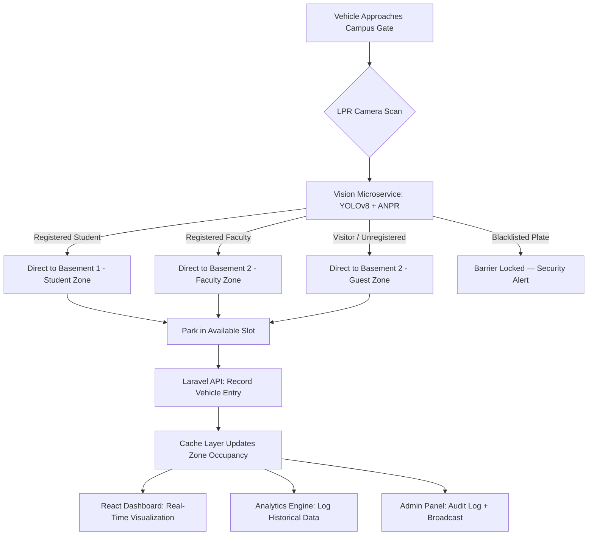
```mermaid
graph TD
    A[Vehicle Approaches Campus Gate] --> B{LPR Camera Scan}
    B --> C[Vision Microservice: YOLOv8 + ANPR]
    C -->|Registered Student| D[Direct to Basement 1 - Student Zone]
    C -->|Registered Faculty| E[Direct to Basement 2 - Faculty Zone]
    C -->|Visitor / Unregistered| F[Direct to Basement 2 - Guest Zone]
    C -->|Blacklisted Plate| G[Barrier Locked — Security Alert]
    D --> H[Park in Available Slot]
    E --> H
    F --> H
    H --> I[Laravel API: Record Vehicle Entry]
    I --> J[Cache Layer Updates Zone Occupancy]
    J --> K[React Dashboard: Real-Time Visualization]
    J --> L[Analytics Engine: Log Historical Data]
    J --> M[Admin Panel: Audit Log + Broadcast]
```

---

## 🔌 API Endpoints

### Laravel Backend (`/api/v1`)

| Method | Endpoint | Description |
| :--- | :--- | :--- |
| `GET` | `/parking-status` | All zone occupancy (filter by `?basement=B1` or `B2`) |
| `GET` | `/parking-status/{zoneId}` | Single zone by ID |
| `GET` | `/parking-slots` | All individual slot data (filter by `?zoneId=student-b1`) |
| `POST` | `/parking-status/refresh` | Trigger telemetry refresh |
| `GET` | `/analytics/dashboard` | Live campus-wide KPI statistics |
| `GET` | `/analytics/hourly` | Hourly occupancy breakdown |
| `GET` | `/analytics/daily` | Daily usage per zone/category |
| `GET` | `/analytics/weekly-comparison` | Week-over-week trend data |
| `POST` | `/analytics/predict` | ML demand prediction output |
| `POST` | `/vehicles/entry` | Register vehicle entry & assign zone |
| `POST` | `/vehicles/exit` | Record vehicle exit |
| `GET` | `/vehicles` | Full vehicle registry |
| `GET` | `/vehicles/{plate}` | Lookup vehicle by plate number |
| `GET` | `/cameras` | All 8 CCTV camera statuses |
| `GET` | `/cameras/{id}` | Single camera node details |
| `POST` | `/auth/login` | Admin authentication (BCrypt + HMAC token) |
| `POST` | `/auth/logout` | Terminate session |
| `GET` | `/auth/me` | Validate token & return user profile |
| `GET` | `/notifications` | All campus notifications |
| `PATCH` | `/notifications/{id}/read` | Mark notification as read |
| `GET` | `/admin/users` | List all operator accounts |
| `GET` | `/admin/logs` | System audit log entries |
| `POST` | `/admin/zones/{id}/update` | Update zone configuration |

### Vision Microservice (`/api/v1/ml`)

| Method | Endpoint | Description |
| :--- | :--- | :--- |
| `GET` | `/` | Health check & YOLOv8 engine status |
| `POST` | `/detect-slots` | Analyze frame for slot occupancy (multipart image) |
| `POST` | `/read-plate` | Bangladeshi ANPR license plate recognition |
| `GET` | `/camera-analytics` | Live analytics for all 8 campus camera nodes |

---

## 🖥️ Page Walkthrough & Screenshots

### 1. Home Page
The dashboard landing page. Showcases real-time summary cards, current basement utilization bars, key features, platform capabilities, and the complete operational workflow.
<p align="center">
  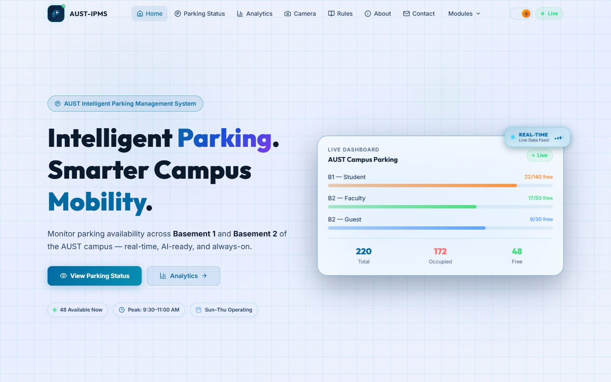
</p>

### 2. Live Parking Status
An interactive layout map representing Basement 1 and Basement 2. Slot data is fetched live from the Laravel REST API. Users can filter by basement and hover over slots to check details. Slots change color dynamically (Green = Available, Red = Occupied, Purple = Reserved).
<p align="center">
  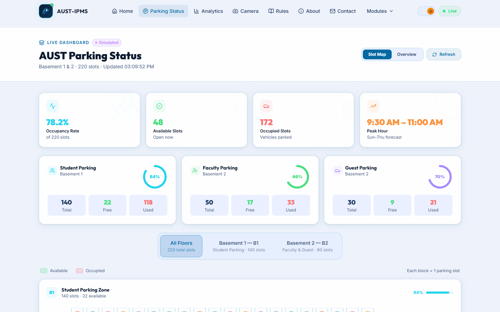
</p>

### 3. Occupancy Analytics
Integrates Recharts to provide detailed visual representations of parking trends. Includes a Peak Hour Alert banner, Hourly Occupancy charts, Daily Occupancy logs, and Week-over-Week comparisons.
<p align="center">
  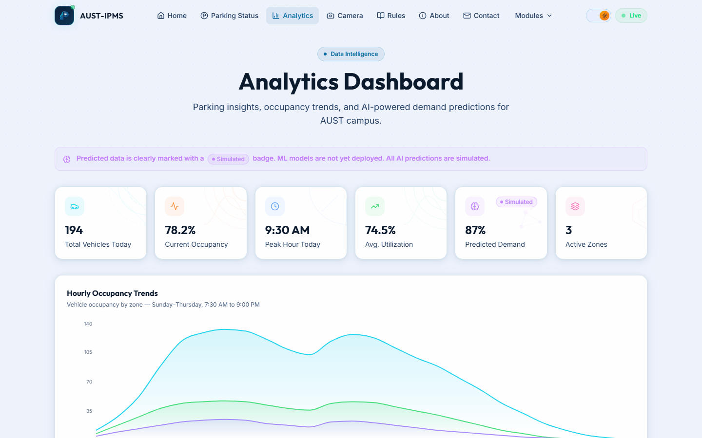
</p>

### 4. Camera Monitoring
Live CCTV node management grid. Each of the 8 campus cameras displays real-time analytics from the YOLOv8 Vision microservice, including vehicle counts, FPS, resolution, and detection status. Supports online/offline toggling and latency ping diagnostics.
<p align="center">
  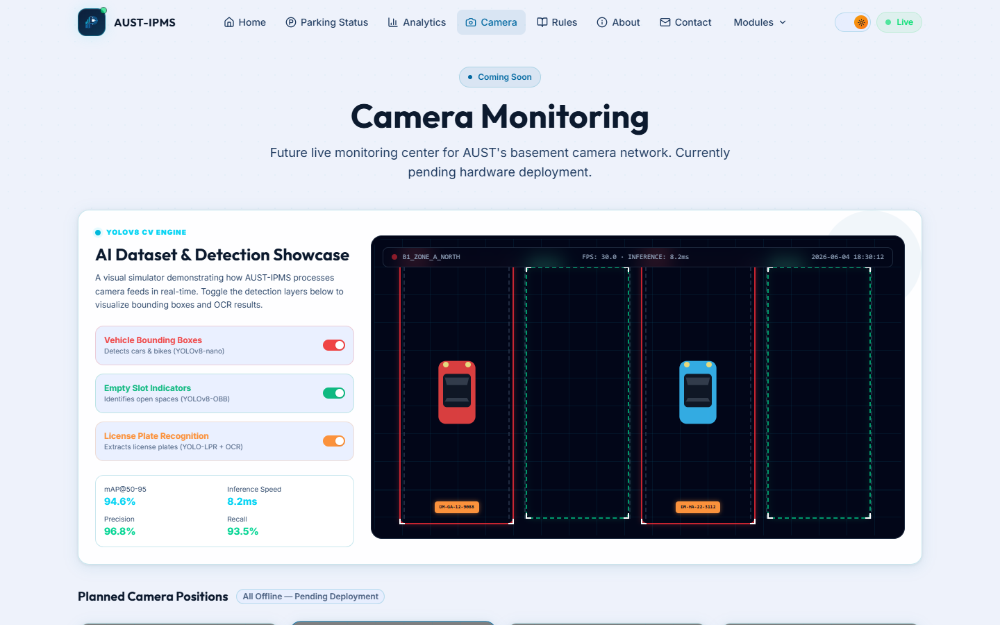
</p>

### 5. Rules & Regulations
Outlines the official parking policies of the university, including operational timings (Sunday–Thursday, 7:30 AM – 9:00 PM), speed limits (15 km/h), vehicle classification criteria, and rules for entry/exit gates.
<p align="center">
  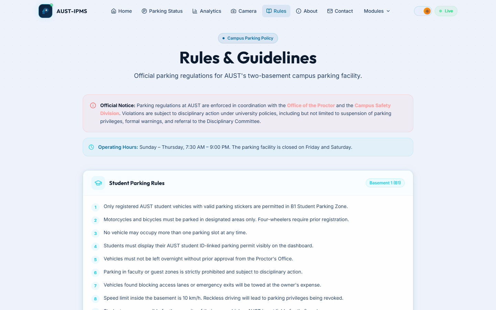
</p>

### 6. About AUST-IPMS
Contains the detailed project background, development objectives, aligned governance authorities, and a comprehensive breakdown of the project development phases.
<p align="center">
  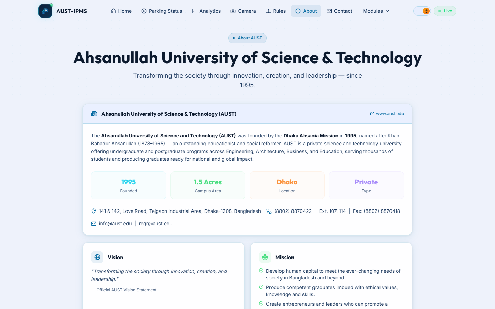
</p>

### 7. Notifications & Alerts
A dedicated alert center informing users of peak traffic status, slot limits reached, scheduled maintenance, or unrecognized vehicle logs.
<p align="center">
  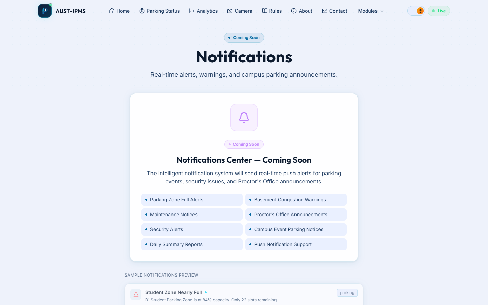
</p>

### 8. Admin Control Panel
A full operational command center (accessible via the hidden route `/aust-ipms-admin`) with 8 specialized tabs: Command HUD, Parking Zones, LPR & Vehicles, Surveillance, Broadcasts, Access Control, AI & Diagnostics, and Audit Trail.
<p align="center">
  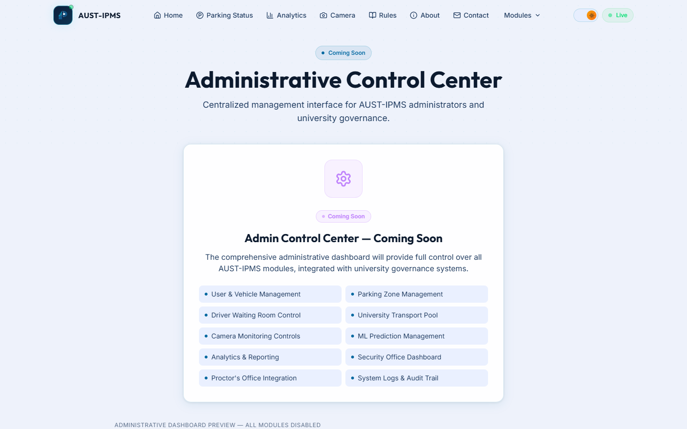
</p>

### 9. User Profile
Provides logged-in users (Students, Faculty, or Admins) with details of their registered vehicles, active parking sessions, and roles.
<p align="center">
  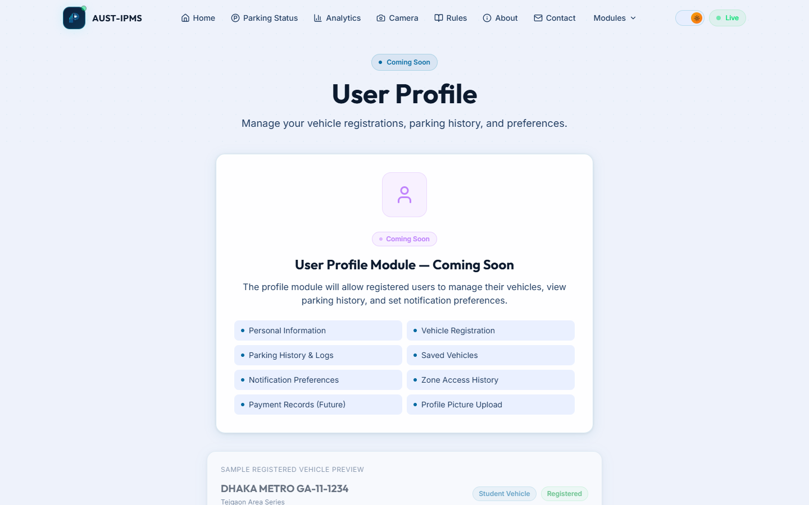
</p>

### 10. Login Portal
Secure authentication gateway for student, faculty, and administrator credentials. Admin login is authenticated directly against the Laravel API using BCrypt + HMAC-SHA256 session tokens.
<p align="center">
  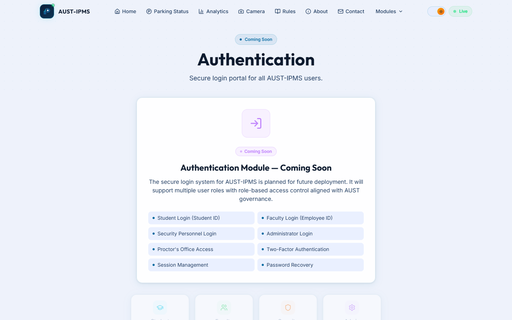
</p>

### 11. Contact & Feedback
A response form allowing AUST members to submit issues, report parking blockages, or ask queries directly to the engineering team.
<p align="center">
  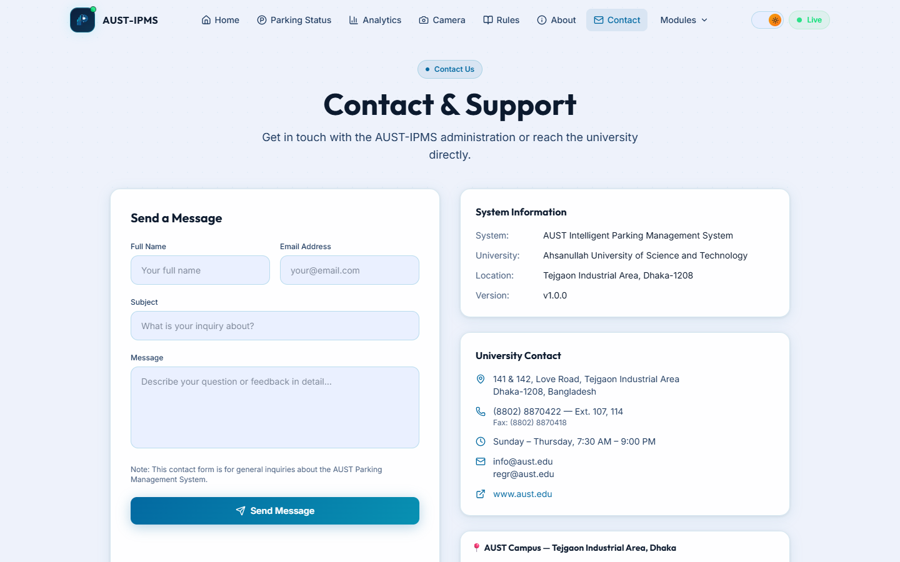
</p>

---

## 🔮 Development Roadmap

| Phase | Scope | Status | Description |
| :--- | :--- | :---: | :--- |
| **Phase 1** | **Frontend Client** | ✅ Complete | Interactive React 19 dashboard with UI layout maps, analytics charts, and responsive design |
| **Phase 2** | **Backend API + Vision ML** | ✅ Complete | Laravel 12 REST API, HMAC auth, AUST gate policy engine, FastAPI + YOLOv8 vision & LPR microservice, Railway + Docker deployment |
| **Phase 3** | **Real Camera Integration** | 🔄 In Progress | Live CCTV RTSP stream ingestion into vision microservice, real-time slot updates via WebSocket |
| **Phase 4** | **ML Demand Forecasting** | 🗓️ Planned | Historical parking demand analysis integrated with AUST academic calendar (exam weeks, holidays) |
| **Phase 5** | **System Integration** | 🗓️ Planned | Integration with AUST ICT Center database, physical gate barrier control, and RFID/NFC vehicle tags |

---

## 🚀 Getting Started

### Prerequisites

| Service | Requirement |
| :--- | :--- |
| Frontend | [Node.js](https://nodejs.org/) v20+ |
| Backend | [PHP](https://www.php.net/) 8.2+, [Composer](https://getcomposer.org/) 2.x |
| Vision ML | [Python](https://www.python.org/) 3.10+ |
| All (Docker) | [Docker Desktop](https://www.docker.com/products/docker-desktop/) |

### Option A: Run with Docker Compose (Recommended)

Start all 3 services with a single command:

```bash
git clone https://github.com/oritri98/Smart_Parking_Lot
cd AUST-IPMS
docker-compose up --build
```

| Service | URL |
| :--- | :--- |
| Frontend UI | http://localhost:3000 |
| Laravel Backend API | http://localhost:8000/api/v1/parking-status |
| Vision ML Docs | http://localhost:8001/docs |

### Option B: Run Services Individually

#### 1. Laravel Backend API
```bash
cd backend
composer install
cp .env.example .env
php artisan key:generate
php artisan migrate
php artisan serve --port=8000
```

#### 2. FastAPI Vision & LPR Microservice
```bash
cd vision-service
pip install -r requirements.txt
uvicorn main:app --host 0.0.0.0 --port 8001 --reload
```

#### 3. React Frontend
```bash
cd frontend
npm install
npm run dev
# Access at http://localhost:5173
```

---

## ☁️ Cloud Deployment (Railway)

All 3 services are fully Railway-deploy-ready with `Dockerfile` and `railway.json` configurations in each directory.

```bash
# Install Railway CLI
npm install -g @railway/cli
railway login

# Deploy each service
cd vision-service && railway up
cd ../backend && railway up
cd ../frontend && railway up
```

**Required Environment Variables per Service:**

| Service | Variable | Description |
| :--- | :--- | :--- |
| `backend` | `APP_KEY` | Laravel app key (already generated in `.env`) |
| `backend` | `IPMS_ADMIN_EMAIL` | Admin login email |
| `backend` | `IPMS_ADMIN_HASH` | BCrypt password hash |
| `backend` | `APP_ENV` | `production` |
| `vision-service` | `YOLO_WEIGHTS_PATH` | YOLOv8 model weights file path |
| `frontend` | `VITE_API_BASE_URL` | Deployed backend Railway URL + `/api/v1` |
| `frontend` | `VITE_VISION_API_URL` | Deployed vision service Railway URL + `/api/v1/ml` |


---

## 🏛️ Governance Alignment

This project is developed to align with AUST campus infrastructure guidelines and in coordination with:
- **Office of the Proctor**, AUST
- **Security Office**, AUST
- **ICT Center**, AUST
  

---

## 👥 Core Contributors

*   **👨‍💻 M.M. Faysal Iqbal** — **Lead Developer & Service Architect**
    *   Designed and implemented the Laravel 12 REST API backend with HMAC-SHA256 authentication and the AUST gate policy engine.
    *   Built the FastAPI + YOLOv8 Vision & LPR microservice (`vision-service/`) with Bangladeshi ANPR recognition.
    *   Implemented all deployment infrastructure (Dockerfiles, docker-compose.yml, Railway configs).
    *   Developed the Admin Control Panel (8 modules), Camera Monitoring interface, and user authentication pages.

*   **👩‍💻 Ismat Erena Siddiquee** — **Frontend Architect & UI Developer**
    *   Established the project build configuration, routing architecture (React Router v7), and global Theme/Auth Context.
    *   Designed and styled key UI components, Main Layout, Navbar, Footer, and navigation interfaces.
    *   Developed interactive pages including Live Parking Status, Occupancy Analytics charts, and Rules view.

---

## 🤝 Contribution Guidelines

Contributions are welcome! Please follow these guidelines:

1. **Fork** the repository.
2. **Create a new branch** (`git checkout -b feature/AmazingFeature`).
3. **Commit your changes** (`git commit -m 'Add some AmazingFeature'`).
4. **Push to the branch** (`git push origin feature/AmazingFeature`).
5. **Open a Pull Request**.

---

<p align="center">
  Developed with ❤️ for AUST Campus Mobility
</p>
